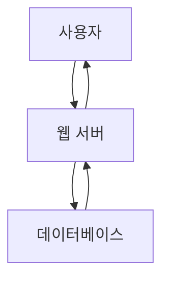
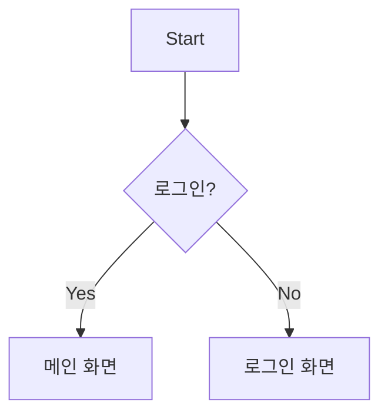
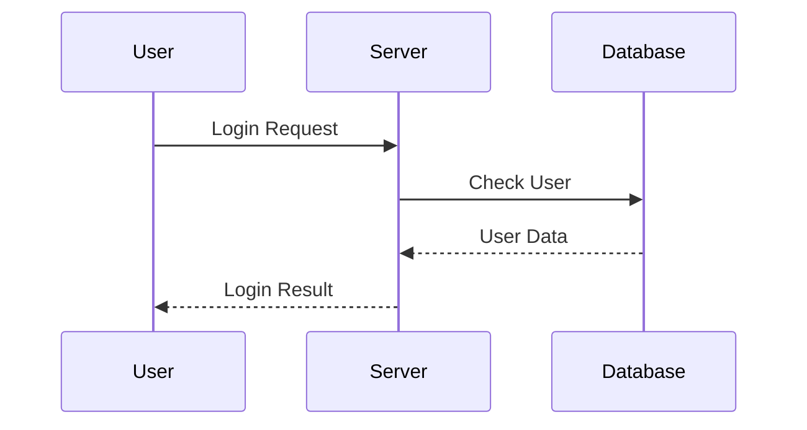

# Markdown A to Z — 컴퓨터공학과 학생을 위한 완전 정리

> 대상: 컴퓨터공학과 학생  
> 목적: GitHub README, 프로젝트 문서, 개발 블로그, 과제 문서, 협업 문서에서 Markdown을 **직접 작성하고 구조적으로 활용**할 수 있도록 하는 것  
> 기준: CommonMark를 기본으로 하고, 실무에서 매우 많이 사용하는 GitHub Flavored Markdown(GFM)을 함께 설명

---

## 0. Markdown이란?

Markdown은 **일반 텍스트에 간단한 기호를 붙여 문서의 구조와 서식을 표현하는 경량 마크업 언어(lightweight markup language)**이다.

예를 들어 다음과 같이 작성한다.

```markdown
# Python 프로젝트

이 프로젝트는 **Python**으로 만든 프로그램입니다.

- 입력 처리
- 데이터 분석
- 결과 출력
```

Markdown을 지원하는 프로그램은 이를 사람이 읽기 좋은 형태로 렌더링한다.

핵심은 다음과 같다.

```text
Markdown 원문
    ↓
Markdown Parser
    ↓
HTML 등으로 변환
    ↓
렌더링
```

따라서 Markdown은 단순히 "글자를 예쁘게 만드는 문법"이 아니라,

> **문서의 구조를 표현하는 방법**

이라고 이해하는 것이 좋다.

---

# 1. Markdown과 Markup Language

## 1.1 Markup Language란?

Markup Language는 텍스트에 **구조나 의미를 나타내는 표시(markup)**를 추가하는 언어다.

대표적으로:

- HTML
- XML
- Markdown
- LaTeX

등이 있다.

HTML:

```html
<h1>Python</h1>
<p>Python은 프로그래밍 언어입니다.</p>
```

Markdown:

```markdown
# Python

Python은 프로그래밍 언어입니다.
```

Markdown은 HTML보다 훨씬 간결하게 작성할 수 있다.

---

# 2. Markdown의 특징

## 장점

- 배우기 쉽다.
- 일반 텍스트로도 읽을 수 있다.
- Git과 잘 어울린다.
- 소스 코드와 함께 관리하기 좋다.
- GitHub README에 매우 적합하다.
- 문서의 구조를 빠르게 작성할 수 있다.
- HTML로 변환하기 쉽다.

## 단점

Markdown은 하나의 완전히 동일한 문법만 존재하는 것이 아니다.

대표적인 Markdown 계열:

- Original Markdown
- CommonMark
- GitHub Flavored Markdown(GFM)
- Markdown Extra
- MultiMarkdown
- Pandoc Markdown
- 각 서비스의 자체 Markdown

따라서

> "Markdown에서 무조건 된다"

라고 생각하면 안 된다.

**어떤 Markdown Parser/플랫폼을 사용하는지 확인해야 한다.**

---

# 3. CommonMark와 GFM

## 3.1 CommonMark

CommonMark는 Markdown 문법을 보다 명확하게 정의하기 위한 표준화된 사양이다.

즉,

```text
Markdown
    ↓
구현마다 해석이 조금씩 다름
```

이라는 문제를 줄이기 위한 것이다.

## 3.2 GitHub Flavored Markdown

GitHub는 CommonMark를 기반으로 여러 기능을 추가한 **GitHub Flavored Markdown(GFM)**을 사용한다.

대표적인 기능:

- 표(Table)
- Task List
- 취소선
- 자동 링크
- 각종 GitHub 전용 참조
- 코드 블록 문법 강조
- 각종 GitHub 문서 기능

GitHub에서 README.md를 작성한다면 GFM을 중심으로 공부하는 것이 실용적이다.

---

# 4. .md 파일

Markdown 파일의 일반적인 확장자는:

```text
.md
```

이다.

예:

```text
README.md
INSTALL.md
CONTRIBUTING.md
CHANGELOG.md
```

VS Code에서 다음과 같이 만들 수 있다.

```text
project/
├── README.md
├── main.py
└── requirements.txt
```

GitHub에서는 특히 `README.md`가 중요하다.

---

# 5. 제목(Heading)

Markdown에서는 `#`을 이용해 제목을 만든다.

```markdown
# 제목 1
## 제목 2
### 제목 3
#### 제목 4
##### 제목 5
###### 제목 6
```

HTML의 다음 구조와 비슷하다.

```html
<h1>제목 1</h1>
<h2>제목 2</h2>
<h3>제목 3</h3>
```

## 권장 구조

```markdown
# 프로젝트 이름

## 1. 프로젝트 소개

### 1.1 개발 목적

### 1.2 주요 기능

## 2. 설치 방법

## 3. 사용 방법
```

중요한 점은 제목의 크기를 꾸미기 위해 사용하는 것이 아니라 **문서의 계층 구조를 표현하기 위해 사용한다는 것**이다.

---

# 6. 문단

문단을 나누려면 빈 줄을 넣는다.

```markdown
첫 번째 문단입니다.

두 번째 문단입니다.
```

렌더링 결과:

첫 번째 문단입니다.

두 번째 문단입니다.

---

# 7. 줄바꿈

Markdown에서는 단순히 Enter를 한 번 누른다고 항상 HTML의 줄바꿈(`<br>`)이 되는 것은 아니다.

다음과 같이 할 수 있다.

## 방법 1: 빈 줄

```markdown
첫 번째 문단

두 번째 문단
```

## 방법 2: 줄 끝에 두 칸

```markdown
첫 번째 줄  
두 번째 줄
```

## 방법 3: 백슬래시

```markdown
첫 번째 줄\
두 번째 줄
```

GitHub에서는 HTML의 `<br>`도 사용할 수 있다.

```markdown
첫 번째 줄<br>
두 번째 줄
```

실무에서는 일반적인 문단 구분에는 **빈 줄**을 사용하는 것이 가장 읽기 좋다.

---

# 8. 굵게(Bold)

```markdown
**굵은 글씨**
```

또는

```markdown
__굵은 글씨__
```

결과:

**굵은 글씨**

---

# 9. 기울임(Italic)

```markdown
*기울임*
```

또는

```markdown
_기울임_
```

결과:

*기울임*

---

# 10. 굵게 + 기울임

```markdown
***굵고 기울어진 글씨***
```

또는 중첩해서:

```markdown
**굵은 글씨 안의 _기울임_**
```

---

# 11. 취소선

GFM에서는 다음과 같이 사용할 수 있다.

```markdown
~~삭제된 내용~~
```

결과:

~~삭제된 내용~~

---

# 12. 인라인 코드

프로그래밍 문서에서 매우 중요하다.

백틱(backtick) 하나를 사용한다.

```markdown
`print()`
```

결과:

`print()`

예:

```markdown
Python의 `print()` 함수는 값을 출력한다.
```

프로그래밍 언어, 함수명, 변수명, 파일명, 명령어 등을 설명할 때 매우 유용하다.

---

# 13. 코드 블록

여러 줄의 코드를 표현하려면 백틱 3개를 사용한다.

````markdown
```python
name = "John Doe"
print(name)
```
````

결과:

```python
name = "John Doe"
print(name)
```

---

# 14. 코드 블록의 언어 지정

첫 번째 백틱 뒤에 언어 이름을 넣으면 syntax highlighting을 사용할 수 있다.

```markdown
```python
print("Hello")
```
```

```markdown
```java
System.out.println("Hello");
```
```

```markdown
```javascript
console.log("Hello");
```
```

```markdown
```c
printf("Hello");
```
```

```markdown
```bash
python main.py
```
```

자주 사용하는 지정값:

| 언어 | 지정 |
|---|---|
| Python | `python` |
| Java | `java` |
| C | `c` |
| C++ | `cpp` |
| JavaScript | `javascript` |
| TypeScript | `typescript` |
| HTML | `html` |
| CSS | `css` |
| SQL | `sql` |
| Bash | `bash` |
| JSON | `json` |
| XML | `xml` |
| YAML | `yaml` |
| Markdown | `markdown` |
| plaintext | `text` |

---

# 15. 중첩 백틱

코드 안에 백틱을 보여줘야 한다면 백틱을 더 많이 사용한다.

예:

````markdown
``Use `print()` in Python.`` 
````

백틱의 개수가 안쪽 내용과 충돌하지 않도록 조절하면 된다.

---

# 16. 인용문(Blockquote)

`>`를 사용한다.

```markdown
> 이것은 인용문입니다.
```

결과:

> 이것은 인용문입니다.

여러 줄:

```markdown
> 첫 번째 줄
> 두 번째 줄
```

중첩:

```markdown
> 첫 번째 인용
>> 두 번째 인용
```

---

# 17. 목록(List)

## 17.1 순서 없는 목록

```markdown
- Python
- Java
- C++
```

또는:

```markdown
* Python
* Java
* C++
```

또는:

```markdown
+ Python
+ Java
+ C++
```

실무에서는 일관성을 위해 `-`를 가장 많이 사용하는 편이다.

---

# 18. 순서 있는 목록

```markdown
1. 요구사항 분석
2. 설계
3. 구현
4. 테스트
5. 배포
```

번호는 문서 구조상 의미가 있다.

---

# 19. 중첩 목록

```markdown
- 프로그래밍
  - Python
  - Java
  - C++
- 데이터베이스
  - MySQL
  - PostgreSQL
```

렌더링:

- 프로그래밍
  - Python
  - Java
  - C++
- 데이터베이스
  - MySQL
  - PostgreSQL

들여쓰기를 이용해 계층을 만든다.

---

# 20. 목록 안에 코드 넣기

```markdown
- `print()`
- `input()`
- `len()`
```

---

# 21. 체크박스(Task List)

GitHub에서 매우 유용하다.

```markdown
- [ ] Python 공부
- [ ] Git 공부
- [x] README 작성
```

결과:

- [ ] Python 공부
- [ ] Git 공부
- [x] README 작성

`[ ]` = 미완료

`[x]` = 완료

프로젝트 TODO 관리에 많이 사용한다.

---

# 22. 링크

기본 형태:

```markdown
[표시할 글자](URL)
```

예:

```markdown
[GitHub](https://github.com)
```

링크 텍스트와 URL을 분리해서 작성할 수 있다.

---

# 23. 링크에 제목 추가

```markdown
[GitHub](https://github.com "GitHub 홈페이지")
```

---

# 24. 자동 링크

일부 Markdown 구현에서는 URL을 그대로 작성해도 링크가 된다.

```markdown
https://github.com
```

GFM에서는 일반 URL 자동 링크도 지원한다.

---

# 25. 이메일 링크

```markdown
<example@example.com>
```

일부 환경에서는 자동으로 이메일 링크가 된다.

---

# 26. 상대 경로 링크

GitHub 프로젝트에서는 상대 경로가 매우 중요하다.

예:

```markdown
[설치 방법](docs/install.md)
```

프로젝트:

```text
project/
├── README.md
└── docs/
    └── install.md
```

README에서 `docs/install.md`를 연결할 수 있다.

---

# 27. 이미지

기본 형태:

```markdown

```

예:

```markdown

```

링크와 거의 동일하지만 앞에 `!`가 붙는다.

```text
링크:
[text](url)

이미지:

```

---

# 28. 이미지 Alt Text

```markdown

```

여기서:

```text
Python 로고
```

가 alt text다.

Alt text는 이미지가 표시되지 않을 때 대체 텍스트가 되며 접근성 측면에서도 중요하다.

---

# 29. 이미지에 링크 걸기

이미지 자체를 클릭 가능한 링크로 만들 수 있다.

```markdown
[](https://github.com)
```

구조를 이해하면:

```text
[ 이미지 ] → 링크
```

이다.

---

# 30. 이미지 크기 조절

순수 Markdown에는 이미지 크기를 조절하는 표준 문법이 없다.

플랫폼에 따라 HTML을 사용할 수 있다.

```html

```

또는:

```html

```

단, **모든 Markdown 환경이 HTML을 동일하게 허용하는 것은 아니다.**

---

# 31. 수평선(Horizontal Rule)

```markdown
---
```

또는:

```markdown
***
```

또는:

```markdown
___
```

예:

```markdown
## 설치 방법

---

## 사용 방법
```

실무에서는 `---`가 가장 직관적이다.

---

# 32. 표(Table)

GFM에서 매우 중요한 기능이다.

```markdown
| 이름 | 학과 | 학년 |
|---|---|---|
| John | 컴퓨터공학과 | 1 |
| Kim | 전자공학과 | 2 |
```

결과:

| 이름 | 학과 | 학년 |
|---|---|---|
| John | 컴퓨터공학과 | 1 |
| Kim | 전자공학과 | 2 |

---

# 33. 표 정렬

왼쪽:

```markdown
| 이름 |
|:---|
| John |
```

가운데:

```markdown
| 이름 |
|:---:|
| John |
```

오른쪽:

```markdown
| 이름 |
|---:|
| John |
```

전체 예:

```markdown
| 이름 | 점수 | 결과 |
|:---|---:|:---:|
| John | 95 | PASS |
| Kim | 87 | PASS |
```

---

# 34. 표의 기본 구조

```text
Header
  ↓
구분선
  ↓
Data
```

```markdown
| Header 1 | Header 2 |
|---|---|
| Data 1 | Data 2 |
```

두 번째 줄은 반드시 열을 구분하는 구조를 제공해야 한다.

---

# 35. 표에서 Markdown 사용

일부 Markdown 문법을 셀 내부에서도 사용할 수 있다.

```markdown
| 함수 | 설명 |
|---|---|
| `print()` | **출력** |
| `input()` | 사용자 입력 |
```

---

# 36. 이스케이프(Escape)

Markdown 기호를 실제 문자로 표시하고 싶다면 `\`를 사용한다.

예:

```markdown
\*별표\*
```

결과:

\*별표\*

대표적인 Markdown 특수문자:

```text
\
`
*
_
{}
[]
()
#
+
-
.
!
|
>
```

문법으로 해석되기를 원하지 않을 때 escape를 고려한다.

---

# 37. 특수문자와 숫자 목록

다음처럼 작성하면:

```markdown
1. 첫 번째
2. 두 번째
```

목록으로 해석된다.

일반적인 숫자 표현을 원한다면 상황에 따라 escape나 다른 표현을 사용해야 한다.

---

# 38. HTML 사용

Markdown은 일부 환경에서 HTML과 함께 사용할 수 있다.

예:

```html
<details>
<summary>자세히 보기</summary>

숨겨진 내용

</details>
```

GitHub README에서 자주 사용되는 패턴이다.

---

# 39. `<br>` 줄바꿈

```html
첫 번째 줄<br>
두 번째 줄
```

단, 가능하면 일반 문서에서는 Markdown 자체의 문단 구조를 먼저 사용한다.

---

# 40. `<sub>` 아래첨자

GitHub에서는 HTML을 이용해 아래첨자를 표현할 수 있다.

```html
H<sub>2</sub>O
```

결과:

H₂O

---

# 41. `<sup>` 위첨자

```html
x<sup>2</sup>
```

결과:

x²

---

# 42. `<ins>` 밑줄

GitHub에서는 다음과 같이 표현할 수 있다.

```html
<ins>밑줄</ins>
```

다만 Markdown 표준 문법 자체에는 일반적인 underline 문법이 없다.

---

# 43. 주석(Comment)

Markdown 파일에 작성하지만 렌더링 화면에는 보이지 않게 하려면 HTML 주석을 사용할 수 있다.

```markdown
<!-- 이 부분은 화면에 표시되지 않습니다. -->
```

주로:

- 문서 작성자 메모
- 임시 설명
- Markdown 구조 메모

등에 사용한다.

주의: **숨겨진 것이 곧 보안상 비밀이라는 뜻은 아니다.**
Markdown 원문을 열면 주석 내용을 볼 수 있다.

---

# 44. 각주(Footnote)

GitHub GFM에서는 각주를 사용할 수 있다.

본문:

```markdown
Markdown은 문서 작성에 사용된다.[^1]
```

각주:

```markdown
[^1]: Markdown은 경량 마크업 언어다.
```

여러 줄 각주도 작성할 수 있다.

---

# 45. 수식(Math)

수식은 Markdown 표준 자체의 기능이라기보다 플랫폼 확장 기능인 경우가 많다.

GitHub에서는 LaTeX 스타일 수식 표현을 사용할 수 있다.

인라인:

```markdown
$E = mc^2$
```

블록:

```markdown
$$
E = mc^2
$$
```

예:

$$
E = mc^2
$$

주의:

> 수식 지원 여부는 Markdown을 사용하는 플랫폼에 따라 다르다.

---

# 46. 개발자에게 중요한 특수 Markdown

## 코드

```markdown
`git status`
```

## 코드 블록

````markdown
```bash
git status
```
````

## 명령 결과

```text
$ git status
On branch main
```

개발 문서에서는 코드와 일반 설명을 확실하게 구분하는 것이 중요하다.

---

# 47. GitHub README의 기본 구조

컴퓨터공학과 학생의 프로젝트라면 다음 구조를 추천한다.

```markdown
# Project Name

프로젝트 한 줄 설명

## 1. 프로젝트 소개

프로젝트의 목적과 문제점

## 2. 주요 기능

- 기능 1
- 기능 2
- 기능 3

## 3. 기술 스택

| 분야 | 기술 |
|---|---|
| Backend | FastAPI |
| Frontend | HTML/CSS/JS |
| Database | MySQL |

## 4. 설치 방법

```bash
git clone ...
pip install -r requirements.txt
```

## 5. 실행 방법

```bash
python main.py
```

## 6. 프로젝트 구조

```text
project/
├── main.py
├── requirements.txt
└── README.md
```

## 7. 사용 방법

사용 방법 설명

## 8. 개발자

John Doe
```

---

# 48. 프로젝트 구조 표현

Markdown의 코드 블록을 이용하면 디렉터리 구조를 표현하기 좋다.

```text
project/
├── README.md
├── main.py
├── requirements.txt
├── src/
│   ├── __init__.py
│   └── main.py
└── tests/
    └── test_main.py
```

이것은 실제 Markdown의 특별한 문법이 아니라 **일반 텍스트를 코드 블록으로 표시하는 방식**이다.

---

# 49. GitHub에서 사용하는 Alert/Callout

GitHub에서는 특별한 blockquote 문법을 사용할 수 있다.

```markdown
> [!NOTE]
> 참고할 내용입니다.
```

```markdown
> [!TIP]
> 유용한 팁입니다.
```

```markdown
> [!IMPORTANT]
> 중요한 내용입니다.
```

```markdown
> [!WARNING]
> 주의해야 합니다.
```

```markdown
> [!CAUTION]
> 위험할 수 있는 내용입니다.
```

이 기능은 모든 Markdown 환경에서 동작하는 표준 Markdown 기능은 아니다.

---

# 50. GitHub 전용 기능

GitHub는 일반 Markdown에 여러 기능을 추가한다.

대표적으로:

- Task List
- Issue 참조
- Pull Request 참조
- @mention
- 자동 링크
- Alert
- 코드 라인 링크
- Mermaid
- 일부 LaTeX 수식
- 접기(`<details>`)

따라서 GitHub에서 문서를 작성한다면 **GFM + GitHub 기능**을 함께 알아야 한다.

---

# 51. Issue / Pull Request 참조

GitHub 저장소에서:

```markdown
#123
```

같은 Issue 번호를 참조하거나 GitHub UI의 자동완성을 이용할 수 있다.

또한:

```markdown
owner/repository#123
```

형태로 다른 저장소의 Issue를 참조하는 방식도 사용할 수 있다.

---

# 52. @mention

GitHub에서는:

```text
@username
```

을 이용해 사용자를 언급할 수 있다.

조직에서는 팀을 언급하는 기능도 제공한다.

이 기능은 일반 Markdown 문법이 아니라 **GitHub의 협업 기능**이다.

---

# 53. Mermaid

GitHub에서는 Mermaid를 이용해 다이어그램을 표현할 수 있다.

예:

````markdown

````

개발자 문서에서:

- Flowchart
- Sequence Diagram
- Class Diagram
- ER Diagram
- State Diagram

등을 표현하는 데 유용하다.

---

# 54. Mermaid 예시: Flowchart

````markdown

````

---

# 55. Mermaid 예시: Sequence Diagram

````markdown

````

컴퓨터공학과 학생에게 특히 유용한 이유는 **소프트웨어 시스템의 동작 흐름을 코드 형태로 관리할 수 있기 때문**이다.

---

# 56. HTML과 Markdown의 관계

Markdown은 HTML을 완전히 대체하는 언어가 아니다.

Markdown:

```markdown
# Hello
```

대략적인 HTML:

```html
<h1>Hello</h1>
```

Markdown Parser는 Markdown을 HTML 등의 출력 형식으로 변환할 수 있다.

즉:

```text
Markdown
   ↓
Parser
   ↓
HTML
   ↓
Browser
```

라고 생각하면 된다.

---

# 57. Markdown Parser

Markdown 파일 자체는 브라우저가 HTML처럼 직접 해석하는 것이 아니다.

일반적인 개념:

```text
README.md
    ↓
Markdown Parser
    ↓
HTML
    ↓
Browser
```

대표적인 구현/도구:

- cmark
- commonmark.js
- markdown-it
- Pandoc
- GitHub의 Markdown 처리 시스템

플랫폼에 따라 사용하는 parser와 확장 기능이 다를 수 있다.

---

# 58. Markdown은 프로그래밍 언어인가?

일반적으로 Markdown을 **프로그래밍 언어라고 부르지는 않는다.**

프로그래밍 언어:

```text
Python
Java
C
C++
JavaScript
```

Markdown:

```text
문서의 구조와 표현을 기술
```

즉 Markdown은 **마크업 언어**다.

---

# 59. Markdown과 HTML 비교

| 항목 | Markdown | HTML |
|---|---|---|
| 목적 | 문서 작성 | 웹 문서 구조 |
| 문법 | 간단 | 상대적으로 복잡 |
| 가독성 | 높음 | 태그가 많음 |
| 표현력 | 제한적 | 매우 높음 |
| 확장 | 플랫폼별 차이 | 표준 HTML 중심 |
| Git 문서 | 매우 좋음 | 가능하지만 불편 |
| README | 매우 적합 | 비효율적 |

예:

Markdown:

```markdown
# Hello
```

HTML:

```html
<h1>Hello</h1>
```

---

# 60. Markdown과 LaTeX 비교

LaTeX는 특히 수학, 논문, 학술 문서에 강하다.

Markdown:

```markdown
# 결과

실험 결과는 다음과 같다.
```

LaTeX:

```latex
\section{결과}

실험 결과는 다음과 같다.
```

Markdown은 **일상적인 개발 문서**에 더 간단하고, LaTeX는 **복잡한 수식과 출판 수준의 문서**에 강하다.

---

# 61. Markdown과 Git

컴퓨터공학과 학생에게 Markdown이 중요한 가장 큰 이유 중 하나가 Git과의 궁합이다.

예:

```text
Git Repository
│
├── README.md
├── docs/
│   ├── architecture.md
│   └── API.md
├── src/
└── tests/
```

문서도 소스 코드와 함께 버전 관리할 수 있다.

```bash
git add README.md
git commit -m "Update README"
git push
```

---

# 62. README.md가 중요한 이유

GitHub 프로젝트를 열었을 때 README는 프로젝트를 설명하는 첫 번째 문서가 되는 경우가 많다.

좋은 README는 다음 질문에 답한다.

1. 이 프로젝트가 무엇인가?
2. 왜 만들었는가?
3. 어떤 기능이 있는가?
4. 어떻게 설치하는가?
5. 어떻게 실행하는가?
6. 어떤 기술을 사용했는가?
7. 프로젝트 구조는 어떻게 되어 있는가?
8. 어떻게 사용하는가?
9. 개발자는 누구인가?
10. 라이선스는 무엇인가?

---

# 63. 좋은 README 구조

추천:

```text
프로젝트명
↓
한 줄 소개
↓
Demo / Screenshot
↓
프로젝트 배경
↓
주요 기능
↓
기술 스택
↓
설치 방법
↓
실행 방법
↓
사용 방법
↓
프로젝트 구조
↓
API
↓
테스트
↓
문제 해결
↓
기여 방법
↓
라이선스
↓
개발자
```

프로젝트의 규모에 따라 필요한 항목만 선택하면 된다.

---

# 64. API 문서 작성

예:

```markdown
## API

### GET /users

사용자 목록을 조회한다.

#### Response

```json
{
  "users": [
    {
      "id": 1,
      "name": "John Doe"
    }
  ]
}
```
```

개발자 문서에서는 다음과 같은 구조가 읽기 좋다.

```text
Method
Endpoint
Description
Parameters
Request
Response
Error
Example
```

---

# 65. JSON을 Markdown에서 보여주기

````markdown
```json
{
  "name": "John Doe",
  "age": 20
}
```
````

---

# 66. Bash 명령어 문서화

````markdown
```bash
git clone https://github.com/example/project.git
cd project
pip install -r requirements.txt
python main.py
```
````

사용자가 복사해서 실행할 수 있는 명령은 **bash 코드 블록**으로 표현하는 것이 좋다.

---

# 67. 설치 문서의 좋은 형태

```markdown
## Installation

### 1. Repository Clone

```bash
git clone ...
cd project
```

### 2. Dependency Installation

```bash
pip install -r requirements.txt
```

### 3. Run

```bash
python main.py
```
```

단계를 분리하면 초보자도 이해하기 쉽다.

---

# 68. 환경 변수 문서화

민감한 값을 README에 직접 넣으면 안 된다.

나쁜 예:

```markdown
API_KEY=abc123-secret
```

좋은 예:

```markdown
```env
API_KEY=your_api_key_here
DATABASE_URL=your_database_url_here
```
```

그리고:

```text
.env
```

를 `.gitignore`에 넣는 것이 일반적이다.

---

# 69. Markdown에서 비밀정보를 숨길 수 있는가?

아니다.

다음:

```markdown
<!-- API_KEY=secret -->
```

은 렌더링 화면에서는 보이지 않을 수 있지만 원본 파일에는 존재한다.

따라서:

> Markdown 주석 ≠ 보안

이다.

API Key, 비밀번호, Access Token 등은 Git 저장소에 올리지 않는 것이 원칙이다.

---

# 70. 상대 경로와 프로젝트 문서

프로젝트 구조:

```text
project/
├── README.md
├── docs/
│   ├── API.md
│   └── INSTALL.md
└── images/
    └── architecture.png
```

README:

```markdown
[API 문서](docs/API.md)

[설치 문서](docs/INSTALL.md)


```

이 방식은 저장소를 clone한 다른 사람에게도 동일하게 작동하기 때문에 매우 중요하다.

---

# 71. Anchor와 목차

Markdown 제목은 많은 플랫폼에서 자동으로 anchor가 생성된다.

예:

```markdown
## Installation
```

일반적으로:

```text
#installation
```

같은 형태의 anchor가 만들어진다.

따라서:

```markdown
[설치 방법으로 이동](#installation)
```

같은 내부 링크를 사용할 수 있다.

단, 정확한 anchor 생성 규칙은 플랫폼에 따라 차이가 있을 수 있다.

---

# 72. 목차(TOC)

간단한 문서는 직접 작성할 수 있다.

```markdown
## 목차

1. [프로젝트 소개](#프로젝트-소개)
2. [설치 방법](#설치-방법)
3. [사용 방법](#사용-방법)
```

GitHub에서는 제목을 기반으로 문서 탐색 기능을 제공하기도 한다.

---

# 73. 접기/펼치기

GitHub README에서 자주 사용하는 방법:

```html
<details>
<summary>실행 결과 보기</summary>

```text
Hello World
```

</details>
```

긴 로그나 부가 정보를 접어두는 데 유용하다.

---

# 74. 이미지 + 설명

README에서 프로젝트 화면을 보여줄 때:

```markdown
## 실행 화면


메인 화면에서는 사용자가 데이터를 입력할 수 있다.
```

이미지를 여러 장 사용할 경우 각각 설명을 붙인다.

---

# 75. 배지(Badge)

GitHub README에서 다음과 같은 작은 상태 표시를 자주 볼 수 있다.

```markdown

```

예를 들어:

```markdown


```

배지는 Markdown의 핵심 문법이라기보다 **외부 이미지 서비스와 Markdown을 조합한 것**이다.

---

# 76. Markdown 파일의 인코딩

Markdown은 일반 텍스트 파일이다.

한국어를 사용하는 경우 일반적으로 UTF-8을 사용하는 것이 좋다.

```text
README.md
Encoding: UTF-8
```

한글, 영어, 특수문자 등을 안정적으로 표현할 수 있다.

---

# 77. 줄바꿈과 운영체제

텍스트 파일의 줄바꿈은 운영체제에 따라 차이가 있을 수 있다.

대표적으로:

```text
LF   → Unix/Linux/macOS 계열
CRLF → Windows
```

Git과 IDE가 이를 자동으로 처리하는 경우가 많지만 협업 환경에서는 알아둘 필요가 있다.

---

# 78. Markdown 파일의 기본 철학

Markdown에서는 "어떻게 보이게 할 것인가"보다

> **이 내용이 무엇인가?**

를 표현하는 것이 중요하다.

나쁜 문서:

```markdown
# 글씨 크게

### 글씨 조금 작게
```

좋은 문서:

```markdown
# 프로젝트

## 설치 방법

### Windows

### Linux
```

즉 제목의 크기가 아니라 **문서의 의미와 계층**을 기준으로 제목을 사용한다.

---

# 79. 개발자 문서에서 중요한 Markdown 문법 우선순위

## 반드시 알아야 함

```text
# Heading
**Bold**
*Italic*
`inline code`
```code block```
- List
1. Ordered list
[Link](URL)

> Quote
```

## 실무에서 매우 유용

```text
| Table |
- [ ] Task
- [x] Task
---
<!-- comment -->
```

## GitHub에서 특히 유용

```text
> [!NOTE]
<details>
Mermaid
@mention
Issue reference
Footnote
```

## 상황에 따라

```text
HTML
LaTeX
Badge
Custom anchor
```

---

# 80. 문서 작성 예제

다음은 컴퓨터공학과 학생의 프로젝트 README 예시다.

````markdown
# AI Study Assistant

AI를 활용해 프로그래밍 학습을 보조하는 웹 애플리케이션입니다.

## 1. 프로젝트 소개

컴퓨터공학과 학생이 프로그래밍 문제를 풀면서
코드에 대한 설명과 피드백을 받을 수 있도록 개발했습니다.

## 2. 주요 기능

- 문제 생성
- 코드 제출
- 코드 분석
- 학습 기록 저장

## 3. 기술 스택

| 분야 | 기술 |
|---|---|
| Frontend | HTML, CSS, JavaScript |
| Backend | FastAPI |
| Database | MySQL |
| AI | OpenAI API |

## 4. 프로젝트 구조

```text
project/
├── README.md
├── main.py
├── requirements.txt
├── app/
│   ├── api/
│   ├── models/
│   └── services/
└── tests/
```

## 5. 설치

```bash
git clone https://github.com/example/project.git
cd project
pip install -r requirements.txt
```

## 6. 환경 변수

`.env` 파일을 생성합니다.

```env
API_KEY=your_api_key
DATABASE_URL=your_database_url
```

## 7. 실행

```bash
python main.py
```

## 8. API

### GET /problems

문제 목록을 조회합니다.

### POST /submit

코드를 제출합니다.

Request:

```json
{
  "code": "print('Hello')"
}
```

## 9. 실행 화면


## 10. TODO

- [x] 기본 UI 구현
- [x] 문제 생성
- [ ] 사용자 인증
- [ ] 학습 통계

## 11. License

MIT License
````

---

# 81. Markdown 작성 시 흔한 실수

## 실수 1: 제목을 장식용으로 사용

나쁜 예:

```markdown
# =================
# 설치 방법
# =================
```

좋은 예:

```markdown
## 설치 방법
```

---

## 실수 2: 코드에 백틱을 사용하지 않음

나쁜 예:

```markdown
print() 함수를 사용하세요.
```

좋은 예:

```markdown
`print()` 함수를 사용하세요.
```

---

## 실수 3: 명령어를 일반 문장으로 작성

나쁜 예:

```markdown
터미널에서 git clone을 입력하세요.
```

좋은 예:

````markdown
터미널에서 다음 명령어를 실행합니다.

```bash
git clone https://github.com/example/project.git
```
````

---

## 실수 4: 비밀번호를 README에 넣음

절대 하지 않는다.

```text
DB_PASSWORD=123456
```

같은 실제 비밀번호를 저장소에 올리지 않는다.

---

## 실수 5: 이미지 경로가 틀림

README:

```markdown

```

하지만 실제 파일:

```text
images/image.png
```

이라면:

```markdown

```

이어야 한다.

---

# 82. Markdown 문법 치트시트

| 목적 | 문법 |
|---|---|
| H1 | `# 제목` |
| H2 | `## 제목` |
| H3 | `### 제목` |
| Bold | `**텍스트**` |
| Italic | `*텍스트*` |
| Strike | `~~텍스트~~` |
| Inline Code | `` `code` `` |
| Link | `[text](url)` |
| Image | `` |
| Quote | `> text` |
| Bullet | `- item` |
| Number | `1. item` |
| Checkbox | `- [ ] item` |
| 완료 | `- [x] item` |
| Horizontal Rule | `---` |
| Code Block | ```` ``` ```` |
| Comment | `<!-- comment -->` |
| Footnote | `[^1]` |
| Table | `| A | B |` |
| Escape | `\*` |

---

# 83. 컴퓨터공학과 학생이라면 여기까지 이해해야 한다

Markdown을 단순한 "문서 꾸미기"로만 공부하지 말고 다음 구조까지 이해하는 것이 좋다.

```text
Markdown Source
      ↓
Markdown Parser
      ↓
AST / 내부 구조
      ↓
HTML 등으로 변환
      ↓
Renderer
      ↓
화면
```

실제로 Markdown parser를 구현한다고 생각하면:

```text
입력
 ↓
문자열 분석
 ↓
Block Parsing
 ↓
Inline Parsing
 ↓
구조 생성
 ↓
HTML Rendering
```

과 같은 처리가 필요하다.

---

# 84. Block Element와 Inline Element

Markdown을 이해할 때 중요한 개념이다.

## Block 요소

문서의 큰 구조를 만든다.

예:

- Heading
- Paragraph
- List
- Blockquote
- Code Block
- Table
- Horizontal Rule

## Inline 요소

문장 내부에서 동작한다.

예:

- Bold
- Italic
- Inline Code
- Link
- Image

예:

```markdown
## Python의 `print()` 함수
```

여기서:

```text
##          → Block-level heading
`print()`   → Inline code
```

라고 생각할 수 있다.

---

# 85. Markdown Parsing의 핵심

예를 들어:

```markdown
# Hello
```

parser는 이를 대략:

```text
Heading
 └── level = 1
 └── text = "Hello"
```

처럼 구조화할 수 있다.

그 다음 HTML로:

```html
<h1>Hello</h1>
```

변환할 수 있다.

---

# 86. AST란?

AST(Abstract Syntax Tree)는 소스 문서를 구조화한 트리다.

예:

```markdown
# Hello

**World**
```

개념적으로:

```text
Document
├── Heading(level=1)
│   └── Text("Hello")
│
└── Paragraph
    └── Strong
        └── Text("World")
```

이런 구조를 이해하면 Markdown parser, compiler, interpreter를 공부할 때도 도움이 된다.

---

# 87. Markdown과 컴파일러 개념의 연결

Markdown은 일반적인 프로그래밍 언어와 목적이 다르지만 처리 과정에서 비슷한 개념을 발견할 수 있다.

```text
Source
  ↓
Lexical / Syntactic Analysis
  ↓
Structure
  ↓
Transformation
  ↓
Output
```

프로그래밍 언어:

```text
Python
 ↓
Parser
 ↓
AST
 ↓
Bytecode / Execution
```

Markdown:

```text
Markdown
 ↓
Parser
 ↓
Document Structure
 ↓
HTML
```

따라서 Markdown은 컴퓨터공학과 학생이 **파싱과 문서 처리의 실제 예시**로 이해하기에도 좋다.

---

# 88. Markdown의 표준화가 어려운 이유

초기 Markdown 문법은 모든 상황을 엄격하게 정의하지 않았다.

그래서 여러 Markdown 구현이 생기면서:

```text
Markdown
├── GitHub
├── GitLab
├── Reddit
├── Obsidian
├── VS Code
├── Pandoc
└── 기타 구현
```

처럼 서로 다른 확장 기능이 생겼다.

따라서 개발자로서 중요한 원칙은:

> **Markdown 문법과 특정 플랫폼의 Markdown 기능을 구분한다.**

---

# 89. CommonMark와 GFM을 구분하는 습관

예를 들어:

```markdown
~~취소선~~
```

같은 기능은 특정 Markdown 확장에서 지원될 수 있다.

또:

```markdown
- [x] 완료
```

같은 Task List도 일반 Markdown의 모든 구현에서 보장되는 기능은 아니다.

그러므로 문서를 만들 때:

```text
"Markdown에서 된다"
```

보다는

```text
"GitHub GFM에서 된다"
```

처럼 생각하는 것이 정확하다.

---

# 90. Markdown을 어디에 사용하는가?

컴퓨터공학과 학생이라면 다음에서 자주 사용한다.

## GitHub

```text
README.md
CONTRIBUTING.md
CHANGELOG.md
docs/*.md
```

## GitLab

프로젝트 문서, Issue, Wiki

## 개발 블로그

정적 사이트 생성기:

- Jekyll
- Hugo
- Astro
- Docusaurus
- MkDocs

등

## 메모/지식 관리

- Obsidian
- VS Code
- Notion 일부 기능
- 각종 Markdown 기반 노트 도구

## API 문서

OpenAPI/Swagger와 함께 설명 문서 작성

---

# 91. 좋은 Markdown 문서의 원칙

## 1. 구조를 먼저 설계한다.

```text
제목
 ├── 소개
 ├── 설치
 ├── 사용
 └── API
```

## 2. 코드와 설명을 구분한다.

```markdown
`print()` 함수는 출력에 사용한다.
```

그리고 실제 코드는:

````markdown
```python
print("Hello")
```
````

## 3. 긴 문장은 문단으로 나눈다.

## 4. 목록을 적극적으로 사용한다.

## 5. 표는 비교가 필요할 때만 사용한다.

## 6. 제목의 계층을 유지한다.

## 7. 플랫폼 의존 기능은 남용하지 않는다.

---

# 92. 최종 학습 순서

컴퓨터공학과 학생이라면 다음 순서로 학습하면 된다.

### Level 1 — 기본

```text
.md 파일
Heading
Paragraph
Bold
Italic
Strike
List
Link
Image
```

### Level 2 — 개발 문서

```text
Inline Code
Code Block
Syntax Highlighting
Table
Task List
Quote
Horizontal Rule
```

### Level 3 — GitHub

```text
README
Relative Link
Issue Reference
@mention
Alert
Details
Footnote
Mermaid
```

### Level 4 — 심화

```text
HTML
LaTeX
Anchor
Parser
AST
CommonMark
GFM
Markdown Flavors
```

---

# 93. 최종적으로 외워야 할 15개

아래 15개만 바로 작성할 수 있어도 대부분의 개발 문서를 만들 수 있다.

```markdown
# 제목

## 소제목

**굵게**

*기울임*

~~취소선~~

`코드`

```python
print("Hello")
```

- 목록

1. 순서 목록

> 인용

[링크](https://example.com)


| A | B |
|---|---|
| 1 | 2 |

- [ ] 할 일

- [x] 완료
```

---

# 94. 최종 요약

Markdown은 단순한 장식 문법이 아니다.

컴퓨터공학과 학생에게 Markdown은:

```text
문서 작성 도구
      +
Git/GitHub 협업 도구
      +
개발 문서 작성 도구
      +
프로젝트 설명 도구
      +
문서 구조화 방법
      +
파싱/AST를 이해하는 작은 사례
```

라고 보는 것이 좋다.

특히 개발자로서 가장 중요한 것은 문법을 전부 외우는 것이 아니라,

```text
제목       → 문서 계층
목록       → 항목 구조
코드 블록  → 실행 가능한 코드
표         → 데이터 비교
링크       → 문서 연결
이미지     → 시각 자료
Task List  → 작업 상태
Quote      → 인용/강조
```

처럼 **문서의 의미에 맞는 Markdown 구조를 선택하는 능력**이다.

---

# 부록 A. 빠른 치트시트

```markdown
# H1
## H2
### H3

**Bold**
*Italic*
***Bold Italic***
~~Strike~~

`inline code`

```python
print("Hello")
```

> Quote

- Item
  - Nested Item

1. Item
2. Item

- [ ] TODO
- [x] DONE

[Link](https://example.com)


---

| Name | Score |
|---|---:|
| John | 100 |

[^1]

[^1]: Footnote

<!-- Comment -->

<details>
<summary>Open</summary>

Hidden content

</details>

> [!NOTE]
> Note


```

---

# 부록 B. 개발 프로젝트 README 템플릿

````markdown
# Project Name

> 프로젝트 한 줄 설명

## 📌 Introduction

프로젝트를 만든 이유와 해결하려는 문제를 설명합니다.

## ✨ Features

- Feature 1
- Feature 2
- Feature 3

## 🛠 Tech Stack

| Category | Technology |
|---|---|
| Frontend | |
| Backend | |
| Database | |
| AI | |
| Deployment | |

## 📁 Project Structure

```text
project/
├── README.md
├── src/
├── tests/
└── requirements.txt
```

## ⚙️ Installation

```bash
git clone <repository>
cd <project>
pip install -r requirements.txt
```

## 🚀 Run

```bash
python main.py
```

## 🔐 Environment Variables

```env
API_KEY=your_api_key
```

## 📖 API

### GET /example

설명

### POST /example

설명

## 🖥️ Screenshots


## ✅ TODO

- [x] Feature 1
- [ ] Feature 2
- [ ] Feature 3

## 👨‍💻 Developer

John Doe

## 📄 License

MIT License
````

---

# 부록 C. 반드시 기억할 주의사항

1. Markdown과 GFM은 완전히 같은 것이 아니다.
2. 플랫폼마다 지원하는 Markdown 확장이 다를 수 있다.
3. Markdown 주석은 비밀정보 저장소가 아니다.
4. API Key와 비밀번호를 README에 넣지 않는다.
5. 코드에는 코드 블록을 사용한다.
6. 함수/변수/파일명은 inline code로 표시하면 읽기 좋다.
7. 제목은 글씨 크기가 아니라 문서 계층을 나타낸다.
8. 표는 비교/정리할 때 사용한다.
9. README는 프로젝트 사용자가 처음 보는 문서라는 점을 고려한다.
10. 협업 프로젝트에서는 상대 경로를 적절히 사용한다.
11. 복잡한 문서에서는 목차와 명확한 Heading 구조를 사용한다.
12. GitHub 전용 기능을 사용할 경우 다른 Markdown 환경에서 깨질 가능성을 고려한다.
13. Markdown 원문도 버전 관리되는 코드/문서 자산이다.
14. 문서의 "보기 좋은 정도"보다 "다른 사람이 이해하고 실행할 수 있는 정도"가 중요하다.
15. Markdown의 본질은 **문서 구조를 사람이 읽기 쉬운 텍스트로 표현하는 것**이다.
